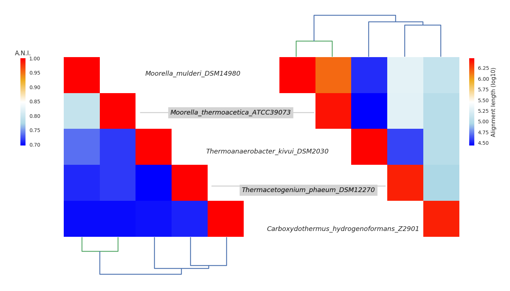

# README.md (DiMHepy)
## Overview
DiMHepy is a Python3 module that provide an alternative view of the outputs produced by the software pyani

## Installation


## Testing DiMHepy


## Running DiMHepy

### Script: `DiMHepy.py`
The `DiMHepy.py` script enables straightforward ANI output rearrangements at the command-line, and uses the `pyani` module behind the scenes.

You can get a summary of available command-line options with `DiMHepy.py -h`

```
$ DiMHepy.py -h
Usage: python3 DiMHepy.py -i pyani_INDIR    -o pyani_OUTDIR    -oss DiMHepy_outImage [option] [arg]
    or python3 DiMHepy.py -ia AlignmentFile -ip PercentageFile -oss DiMHepy_outImage [option] [arg]
Options and arguments (and corresponding environment variables):
-h       : print this help message and exit (also --help)
-i arg   : insert the INDIR of pyani
-o arg   : insert the OUTDIR of pyani
-ia arg  : insert the file name of alignment lengths
-ip arg  : insert the file name of percentage identity)
-oss arg : insert the file name of the output image
-s       : show output png file (only in graphic environment)
-d       : display output interactive window (only in graphic environment)

[…]
```

The graphical output below was generated with the command-line:

```
DiMHepy.py -ia test/dataset5Other/ANIb_alignment_lengths.tab 
           -ip test/dataset5Other/ANIb_percentage_identity.tab 
           -oss test/dataset5Other/ds5Other.png
```


## Dependencies

for a correct operation of DiMHepy you have to run there command in the command line:
```
pip3 install numpy
pip3 install scipy
pip3 install matplotlib
pip3 install biopython
pip3 install pandas
pip3 install seaborn
```


